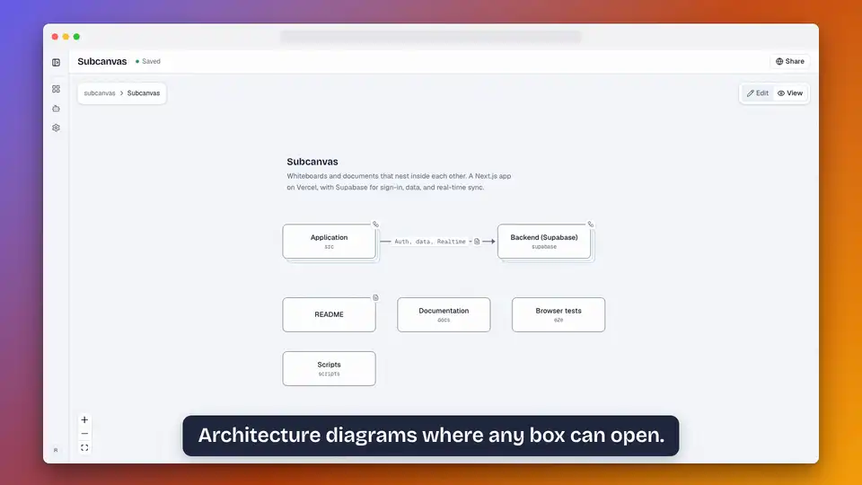

# Subcanvas

**Turn a GitHub repo into a diagram you can click into.** Paste a public repository and each main folder becomes a box with its README inside; a box opens into the folders within it. Then draw the rest: any box or arrow can hold its own whiteboard or a page of notes, as many levels deep as you need.

<!-- The demo, made from scripts/demo/out/demo.mp4 by scripts/demo/readme-preview.sh. -->
<p align="center">
  <a href="https://subcanvas.app">
    
  </a>
</p>

<p align="center"><strong>Try it</strong> at <a href="https://subcanvas.app">subcanvas.app</a> (free, private projects included) · <strong>Run your own</strong> with <a href="docs/DEPLOYMENT.md">docs/DEPLOYMENT.md</a> · <strong>AGPL-3.0</strong></p>

This repository's own diagram, drawn live by subcanvas.app from its folders and `.subcanvas` files. Click it to open the boxes.

<!-- Share, then Copy embed, on the whiteboard at subcanvas.app. -->
<p align="center">
  <a href="https://subcanvas.app/p/0b5a0f09-b2f6-48d5-b6df-005d5d5469c2/d/6b1c4b7a-d57a-4a12-9217-40f898f7e4b2">
    <picture>
      <source media="(prefers-color-scheme: dark)" srcset="https://subcanvas.app/p/0b5a0f09-b2f6-48d5-b6df-005d5d5469c2/d/6b1c4b7a-d57a-4a12-9217-40f898f7e4b2/embed.svg?theme=dark">
      
    </picture>
  </a>
</p>

- **GitHub import.** A box for each main folder (up to 60), with its README inside. A [`.subcanvas` file](docs/SUBCANVAS_FILE.md) in a folder says what it is and what it talks to, and those connections become arrows. The import is a one-time copy.
- **Nesting.** Double-click a box or an arrow to open the whiteboard or page inside it. A trail of tabs shows where you are and leads back out.
- **Live together.** Your account comes with a personal workspace; make a team workspace and everyone you invite to it edits at once, with cursors. Viewers are free.
- **README embeds.** A public whiteboard embeds as a picture that follows your edits within minutes and links to the live version.
- **Agents.** An MCP server lets Claude Code, Codex, Cursor and other agents read and edit as the person who connected them: [docs/MCP.md](docs/MCP.md).
- **Your notes.** Notion, Obsidian, Google Docs and folders of Markdown come in through Import files: [docs/IMPORTING.md](docs/IMPORTING.md).
- **Your work, out.** A page downloads as Markdown and a whiteboard as SVG from its menu, and a whole project exports as a zip of those, with a JSON file of each whiteboard and its pictures and videos, that Import files reads back: [docs/EXPORTING.md](docs/EXPORTING.md).

Subcanvas is live at subcanvas.app and changing fast. What is being built is in [REQUIREMENTS.md](REQUIREMENTS.md), the data model and build order in [docs/ARCHITECTURE.md](docs/ARCHITECTURE.md), and what comes next in [docs/ROADMAP.md](docs/ROADMAP.md).

## Stack

Next.js · Supabase (Auth, Postgres, Realtime, Storage) · React Flow · BlockNote · Yjs · shadcn/ui · Stripe

Subcanvas stands on open source work, with thanks: the whiteboard canvas is [React Flow](https://reactflow.dev) by xyflow (MIT), laid out with [dagre](https://github.com/dagrejs/dagre) (MIT); pages are [BlockNote](https://www.blocknotejs.org) (MPL-2.0); live collaboration is [Yjs](https://yjs.dev) (MIT); the interface is built from [shadcn/ui](https://ui.shadcn.com) and [Base UI](https://base-ui.com) (MIT) with [Lucide](https://lucide.dev) icons (ISC). The canvas does not show React Flow's attribution badge, which its license allows; this paragraph is where the credit lives instead.

## Development

Requires Node 22+, pnpm, Docker, and the [Supabase CLI](https://supabase.com/docs/guides/local-development).

```sh
pnpm install
supabase start              # local Supabase stack; prints the API URL and keys
cp .env.example .env.local  # then paste in the publishable key
pnpm dev
```

| Command | What it does |
|---|---|
| `pnpm dev` | Start the app at http://localhost:3000 |
| `pnpm lint` | ESLint |
| `pnpm typecheck` | TypeScript, no emit |
| `pnpm build` | Production build |
| `pnpm test` | Unit tests (Vitest) for code that needs no browser and no database |
| `pnpm test:e2e` | End-to-end tests (Playwright) in a real browser against a real build |
| `pnpm db:test` | Database tests (pgTAP), including row-level security |
| `pnpm db:types` | Regenerate `src/lib/supabase/database.types.ts` after a migration |
| `supabase db reset` | Rebuild the local database from `supabase/migrations` |

Sign-in is by email and password or by an emailed link. Locally, emails are caught by Mailpit at http://127.0.0.1:54324 instead of being sent. Google and GitHub sign-in are off by default; see the notes at the bottom of `supabase/config.toml`.

After changing `supabase/config.toml`, restart the stack with `supabase stop && supabase start`.

### Tests

Three layers, each answering something the others cannot:

- **`pnpm test`**: Vitest, over code that needs no browser and no database. It is the one that runs in a second, so keep it that way: nothing here may start a server.
- **`pnpm db:test`**: pgTAP, over the migrations. Row-level security is the real permission system, and this is where it is proved.
- **`pnpm test:e2e`**: Playwright, in `e2e/`. A browser signs up, makes a project and a whiteboard, draws on it, reloads, and looks again: the only check that sees a Yjs document reach Postgres and come back. It also reads a public project with no account at all.

The end-to-end suite needs the local stack (`supabase start`) and builds the app before it serves it, on port 3310, so it never fights a `pnpm dev` on 3000. Every spec makes its own account, workspace and project, named after a fresh id, so the specs run in any order, run in parallel, and leave a shared database alone: nothing is deleted. Sign-in links are read back out of Mailpit, the same inbox a person developing here would open, and so are the app's own emails, invites and abuse reports, which `.env.example` sends to Mailpit's SMTP port; the specs that read those skip when `SMTP_HOST` is not set. One spec, `github-import`, runs against a second, development server (port 3410, or `E2E_DEV_PORT`) started with `SUBCANVAS_IMPORT_FIXTURES` pointing at `e2e/fixtures/github`: "Import from GitHub" reads a repository that is a folder there, so no test asks api.github.com for anything. Next refuses a second development server in one checkout, so with `pnpm dev` already open, start that one from another checkout of the repository (a `git worktree` will do) and point the suite at it with `E2E_DEV_BASE_URL`. The billing specs run only when `STRIPE_SECRET_KEY` and `STRIPE_WEBHOOK_SECRET` are set (sandbox values, see [Plans and billing](#plans-and-billing) below) and skip otherwise. The specs in which an agent signs in, and those of the Connect an agent page, need `[auth.oauth_server]` from `config.toml`, which a stack started before that setting only picks up after `supabase stop && supabase start`; without it they skip, and one that checks a server without agent sign-in runs instead. Specs whose pages depend on the server's setup (billing, `NEXT_PUBLIC_AUTH_PROVIDERS`) read it from the environment or `.env.local`, as the server does.

```sh
pnpm test:e2e                       # all of it
pnpm test:e2e whiteboard-node       # one spec
E2E_DEV_BASE_URL=http://localhost:3410 pnpm test:e2e   # with a fixture server you started yourself
pnpm exec playwright test --ui      # watch it happen
pnpm exec playwright show-report    # the last run, in detail
```

Prefer accessible names (`getByRole`, `getByLabel`) to class names, and a web assertion to a sleep. Do not dispatch synthetic mouse events at whiteboard nodes: React Flow hands them to d3-drag, which reads `event.view.document` and throws. Move and press the real mouse, or use the toolbar.

## Public projects and moderation

An admin can make a project public: anyone with the link (`/p/<project id>`) can then read every document in it, and nobody outside the workspace can edit. Public pages are not indexed by search engines, and each carries a Report button.

Reports land in the `abuse_reports` table, readable only by the operator (the Supabase dashboard or SQL), and are emailed to `ABUSE_EMAIL` (or `LEGAL_CONTACT`) when the server sends email. To take a project offline, whatever its workspace sets:

```sql
update public.projects set taken_down_at = now() where id = '<project id>';
```

Its members then see that it was taken down and whom to write to. Reviewing reports, reversing a takedown, and deleting an account by hand are in [docs/OPERATIONS.md](docs/OPERATIONS.md).

### Embedding a diagram

Whiteboards take pictures and videos: drop files on the canvas, paste a screenshot, or use **Media** in the toolbar, and point arrows at them like at any other node (PNG, JPEG, WebP, GIF, AVIF up to 10 MB; MP4, WebM, MOV up to 100 MB).

Any whiteboard in a public project is also served as a picture at `/p/<project id>/d/<document id>/embed.svg` (add `?theme=dark` for the dark version). On the whiteboard's page, Share has **Copy embed**, which copies a snippet for a README or a docs site: the picture, in the reader's light or dark theme, linked to the live whiteboard. The picture is drawn from the whiteboard on request, so it follows edits within a few minutes with no change to the README. A whiteboard that is private, in the trash, or missing gets a picture that says so. Pictures and videos on the whiteboard show in the embed as captioned frames: the embed is one standalone image and never loads another file.

## Plans and billing

Billing is off by default, and a self-hosted server needs none of it: with nothing configured there are no limits, no Billing page, and the Stripe code never runs.

A deployment that sells subscriptions turns on two things:

1. **The free plan's limits**, enforced in the database:
   ```sql
   update private.config set free_private_document_limit = 100, free_editor_limit = 3;
   ```
   Free workspaces then get unlimited documents in public projects, 100 documents across private projects (the descriptions of boxes and arrows, and documents in the trash, do not count), and 3 editors. Viewers are always unlimited and free. A workspace on the paid plan, Pro, has no limits.
2. **Stripe.** Set the Stripe variables in `.env.example`, using a recurring $5 per-editor price. In production, point a Stripe webhook at `/api/stripe/webhook` with the `customer.subscription.*` and `checkout.session.completed` events. Locally, run `pnpm stripe:listen` instead, and keep it running while you test: it forwards the sandbox's events to your dev server, and the signing secret it prints on first run is your local `STRIPE_WEBHOOK_SECRET`. Use a [sandbox](https://docs.stripe.com/sandboxes) secret key, never a live one, in `.env.local`.

## Contributing and security

Bug reports and ideas are welcome as issues; code contributions are not accepted yet: see [CONTRIBUTING.md](CONTRIBUTING.md). To report a security problem, email security@subcanvas.app ([SECURITY.md](SECURITY.md)).

## License

Copyright (C) 2026 Trevin Lee

Subcanvas is free software: you can redistribute it and/or modify it under the terms of the [GNU Affero General Public License](LICENSE) as published by the Free Software Foundation, version 3.

In short: you may self-host and modify it, but if you run a modified version as a network service, you must make your modified source available to its users. It comes with no warranty.
